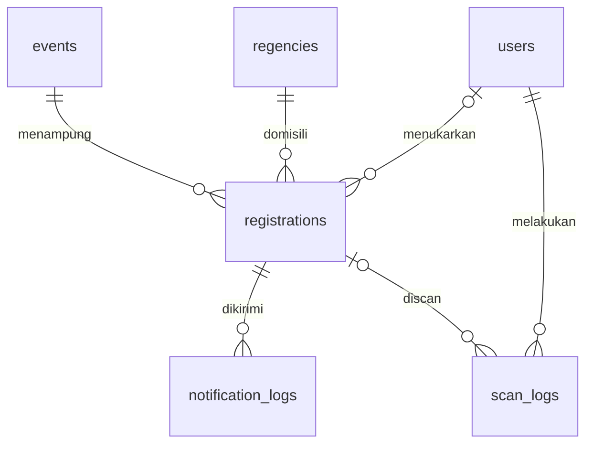

# ERD

Semua tabel InnoDB. Tabel bawaan Laravel (`jobs`, `failed_jobs`, `sessions`, `cache`, `cache_locks`) tetap dipakai; `password_reset_tokens` boleh dihapus karena tidak ada reset password publik.

## events

Satu baris. Target `lockForUpdate()` saat submit.

| Kolom | Migration | Keterangan |
|---|---|---|
| id | `id()` | |
| name | `string('name', 150)` | Opening Ceremony Porprov Jateng XVII 2026 |
| code_prefix | `string('code_prefix', 10)->unique()` | `PJT26` |
| quota | `unsignedInteger('quota')->default(3600)` | |
| tickets_taken | `unsignedInteger('tickets_taken')->default(0)` | Bisa direkonsiliasi dengan `SUM(registrations.ticket_qty)` |
| event_starts_at | `dateTime('event_starts_at')->nullable()` | Ditampilkan di halaman & pesan |
| venue | `string('venue', 200)->nullable()` | Lokasi acara |
| registration_open_at | `dateTime(...)->nullable()` | |
| registration_close_at | `dateTime(...)->nullable()` | |
| is_open | `boolean('is_open')->default(false)` | Saklar manual admin |
| timestamps | `timestamps()` | |

`Event::isOpen()`: `is_open` && (open_at null atau now ≥ open_at) && (close_at null atau now < close_at).

## regencies

Seeder: 35 kabupaten/kota Jawa Tengah + "Luar Jawa Tengah" (sort_order terbesar).

| Kolom | Migration |
|---|---|
| id | `smallIncrements('id')` |
| name | `string('name', 100)->unique()` |
| sort_order | `unsignedSmallInteger('sort_order')` |

## registrations

| Kolom | Migration | Keterangan |
|---|---|---|
| id | `id()` | |
| event_id | `foreignId('event_id')->constrained()->restrictOnDelete()` | |
| code | `string('code', 20)->unique()` | `PJT26-7K3M9Q`, NOT NULL |
| token | `string('token', 64)->unique()` | `Str::random(48)` |
| name | `string('name', 150)` | |
| regency_id | `unsignedSmallInteger('regency_id')` + FK ke `regencies.id` | |
| email | `string('email', 191)` | lowercase |
| phone | `string('phone', 20)` | `62xxx` |
| ticket_qty | `unsignedTinyInteger('ticket_qty')` | 1–4 |
| redeemed_at | `dateTime('redeemed_at')->nullable()->index()` | |
| redeemed_by | `foreignId('redeemed_by')->nullable()->constrained('users')->nullOnDelete()` | |
| ip_address | `string('ip_address', 45)->nullable()` | |
| timestamps | `timestamps()` | |

Index: `unique(['event_id','phone'])`, `unique(['event_id','email'])`, index `name` untuk pencarian manual.

## notification_logs

| Kolom | Migration | Keterangan |
|---|---|---|
| id | `id()` | |
| registration_id | `foreignId(...)->constrained()->cascadeOnDelete()` | |
| channel | `enum('channel', ['email','whatsapp'])` | |
| status | `enum('status', ['pending','sent','failed'])->default('pending')->index()` | |
| attempts | `unsignedTinyInteger('attempts')->default(0)` | |
| last_error | `text('last_error')->nullable()` | |
| provider_message_id | `string(...)->nullable()` | |
| sent_at | `dateTime('sent_at')->nullable()` | |
| timestamps | `timestamps()` | |

Index: `unique(['registration_id','channel'])`.

## users

| Kolom | Migration | Keterangan |
|---|---|---|
| id | `id()` | |
| name | `string('name', 100)` | Mis. "Pos 3 - Andi" |
| username | `string('username', 50)->unique()` | Login pakai username |
| password | `string('password')` | |
| role | `enum('role', ['admin','scanner'])` | |
| is_active | `boolean('is_active')->default(true)` | |
| remember_token | `rememberToken()` | |
| timestamps | `timestamps()` | |

Kolom `email` bawaan Laravel dihapus dari migration users.

## scan_logs

| Kolom | Migration | Keterangan |
|---|---|---|
| id | `id()` | |
| registration_id | `foreignId(...)->nullable()->constrained()->nullOnDelete()` | Null jika QR tidak dikenal |
| user_id | `foreignId('user_id')->constrained()` | |
| scanned_value | `string('scanned_value', 255)` | Isi QR/input mentah |
| method | `enum('method', ['camera','hardware','manual'])` | |
| result | `enum('result', ['success','already_redeemed','not_found'])` | |
| ip_address | `string('ip_address', 45)->nullable()` | |
| scanned_at | `dateTime('scanned_at')->index()` | Tanpa `timestamps()` |
